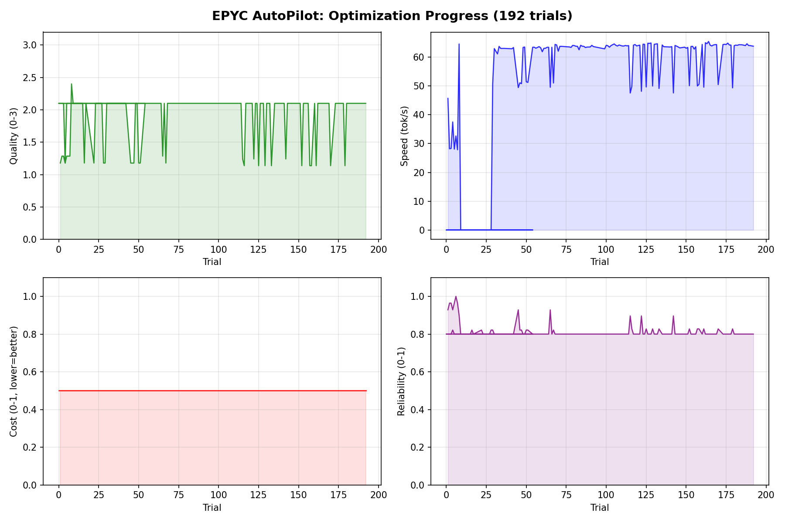
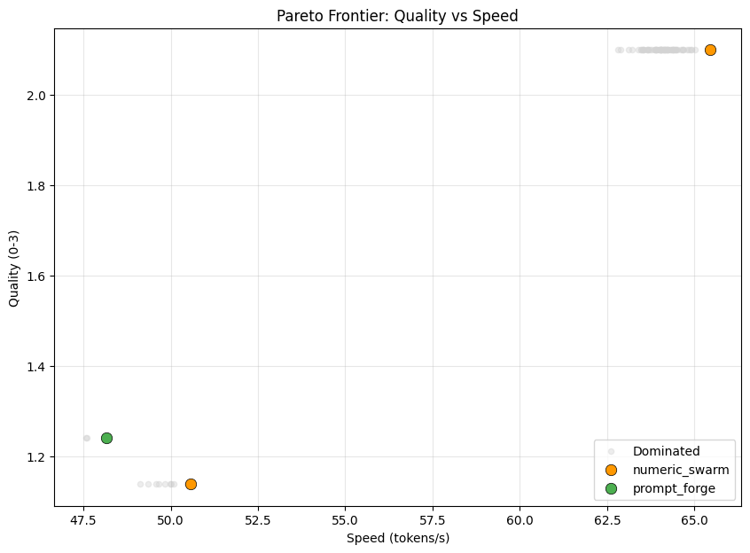
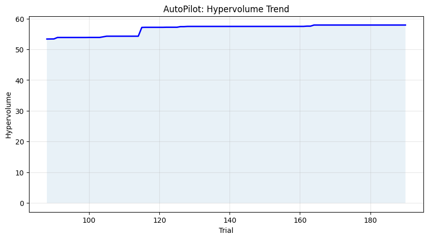
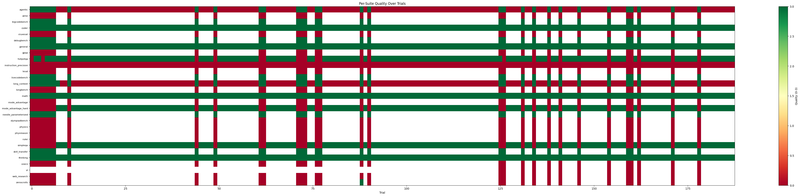
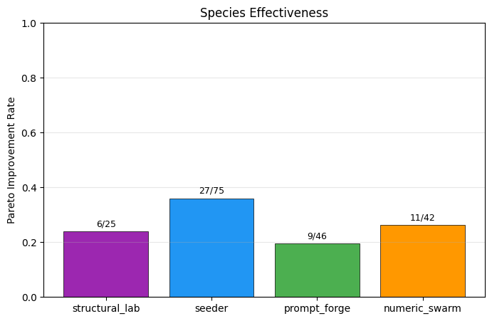
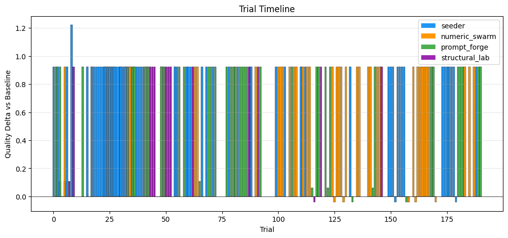
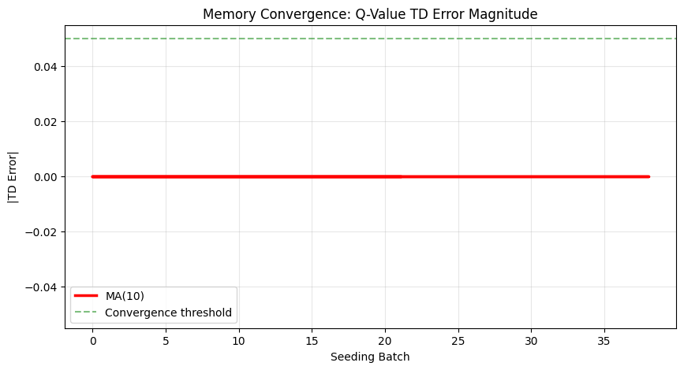

# epyc-orchestrator

Hierarchical multi-model orchestration for local LLM inference on AMD EPYC. Routes tasks across 30 model servers with automatic escalation, speculative decoding, KV cache compression, and autonomous prompt optimization.

## AutoPilot: Continuous Optimization

The orchestrator includes an autonomous optimization loop (AutoPilot) that continuously improves prompts, routing, and model configurations through controlled experiments with safety gates.



**192 trials completed** — quality stable at 2.1/3.0, speed at 64 t/s, 80% reliability. AutoPilot uses 4 species (Seeder, NumericSwarm, PromptForge, StructuralLab) to explore prompt mutations, hyperparameter tuning, and feature flag combinations.

### Diagnostic Plots

| | |
|:---:|:---:|
|  |  |
| **Pareto Frontier** — quality vs speed tradeoff | **Hypervolume Trend** — optimization progress over trials |
|  |  |
| **Per-Suite Quality** — breakdown by benchmark | **Species Effectiveness** — which mutation strategies produce gains |
|  |  |
| **Trial Timeline** — chronological trial outcomes | **Memory Convergence** — episodic memory utilization |

## Production Stack

30 model servers on a single AMD EPYC 9655 (96C/192T, 1.13TB DDR5):

| Role | Model | Instances | Speed | Context |
|------|-------|:---------:|:-----:|:-------:|
| frontdoor | Qwen3.5-35B-A3B | 5 | 14.3 t/s | 32K |
| coder | Qwen2.5-Coder-32B + 0.5B draft | 5 | 21.7 t/s | 32K |
| worker | Qwen3-Coder-30B-A3B + 0.75B draft | 5 | 39 t/s | 8K |
| architect_general | Qwen3.5-122B-A10B + 0.8B draft | 2 | 12.6 t/s | 16K |
| architect_coding | REAP-246B + 0.75B draft | 2 | 12 t/s | 16K |
| ingest | Qwen3-Next-80B-A3B | 1 | — | 32K |
| vision | Qwen2.5-VL-7B + Qwen3-VL-30B | 2 | — | 8-16K |
| embedder | BGE-large-en-v1.5 | 6 | — | 512 |

All models served via llama.cpp `production-consolidated-v3` with KV quantization (q4_0 K / f16 V), flash attention, and Hadamard auto-rotation.

## What It Does

- **Multi-tier routing**: Routes tasks to the optimal model — fast workers for simple queries, architects for complex reasoning
- **Automatic escalation**: Failed or timed-out tasks escalate to more capable tiers
- **Speculative decoding**: Draft models accelerate generation (2-12x speedup)
- **AM KV compaction**: Attention-score-driven KV cache compression via `POST /slots/{id}?action=compact` — 5x compression with zero quality degradation
- **Web search**: DuckDuckGo + Brave fallback with rate limiting
- **Episodic memory**: FAISS-backed session memory with skill tracking
- **Tool execution**: Sandboxed REPL with code execution, web fetch, and plugins
- **Vision pipeline**: Multi-modal support with OCR and image understanding
- **AutoPilot**: Autonomous prompt optimization with safety gates and Pareto archive

## Quick Start

```bash
# 1. Clone and install
git clone https://github.com/pestopoppa/epyc-orchestrator.git
cd epyc-orchestrator
pip install -e ".[dev]"

# 2. Launch stack (production)
python scripts/server/orchestrator_stack.py start

# 3. Pre-flight audit
python scripts/autopilot/preflight_audit.py

# 4. Launch AutoPilot
python scripts/autopilot/autopilot.py start --tui

# 5. Monitor (separate terminal)
python scripts/autopilot/autopilot.py monitor
```

## Architecture

```
Request → FastAPI(:8000) → ChatPipeline → Mode Selection
                                            ├── Direct → LLM call → Response
                                            ├── REPL → Tool loop → Response
                                            └── Delegated → Architect plan → Worker execution

Model Stack (30 servers, 2 NUMA nodes):
  Tier A: Front door (5× Qwen3.5-35B, interactive)
  Tier B: Specialists (5× Coder-32B, 2× Architect-122B, 2× REAP-246B)
  Tier C: Workers (5× 30B-A3B, 1× 80B ingest, 2× VL)
  Tier D: Draft models + embedders (co-loaded)

AutoPilot: Controller → Species (Seeder/NumericSwarm/PromptForge/StructuralLab)
           → EvalTower (T0 sentinel → T1 deep → T2 full)
           → SafetyGate → ParetoArchive → Journal
```

## Eval Suites

30+ benchmark suites with automated scoring:

| Suite | Questions | Scoring | Status |
|-------|:---------:|---------|--------|
| math (GSM8K) | 1,819 | exact_match | scoring |
| coder (MBPP) | 664 | substring | scoring |
| general (MMLU) | 14,042 | multiple_choice | scoring |
| gpqa | 448 | multiple_choice | scoring |
| hotpotqa | 7,405 | f1 | scoring |
| usaco | 520 | code_execution | scoring |
| web_research | 50 | f1 | scoring |
| physics (PHYBench) | 100 | llm_judge | scoring |
| vl (OCRBench) | 2,575 | exact_match | scoring |
| + 20 more | 30K+ | various | scoring |

## Documentation

- **[Architecture Reference](docs/ARCHITECTURE.md)** — module responsibilities, request flow
- **[Chapter Index](docs/chapters/INDEX.md)** — 17 chapters: runtime, REPL, MemRL, escalation, tools, SkillBank
- **[AutoPilot Program](scripts/autopilot/program.md)** — optimization strategy and constraints

## Development

```bash
pytest tests/ -n 8       # Run tests (parallel)
ruff check src/           # Lint
python scripts/autopilot/preflight_audit.py  # 9-check diagnostic
```

## License

MIT — see [LICENSE](LICENSE).
