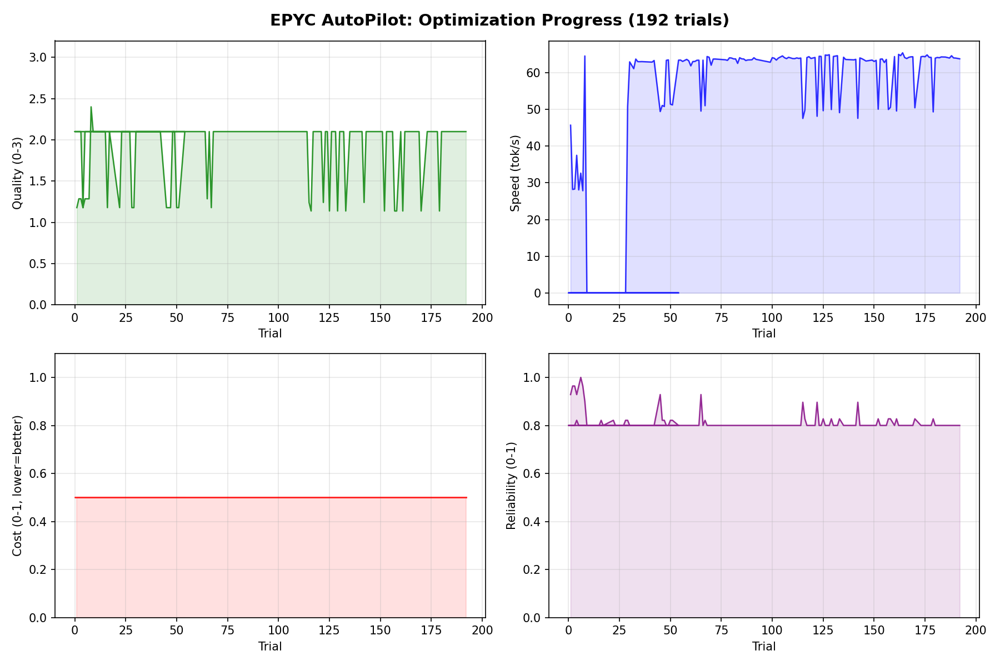
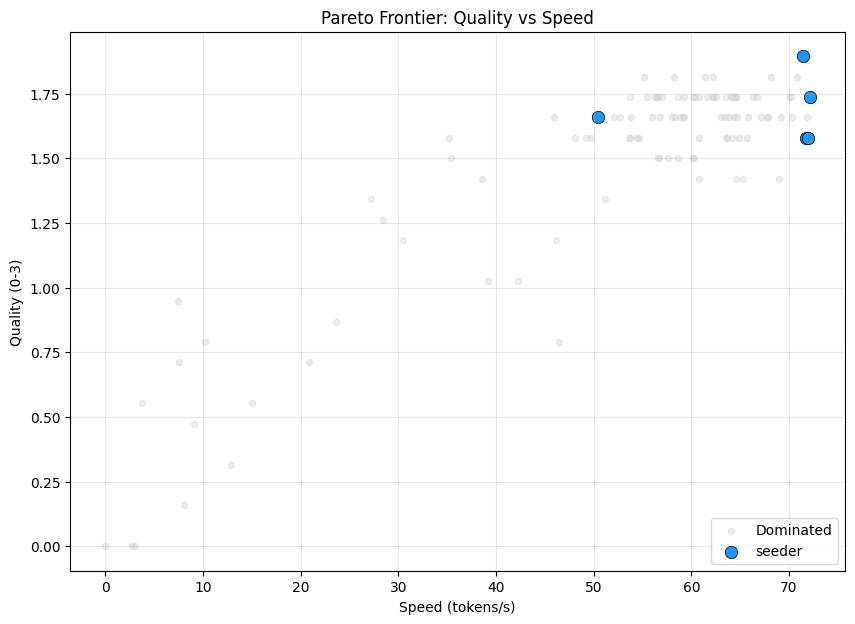
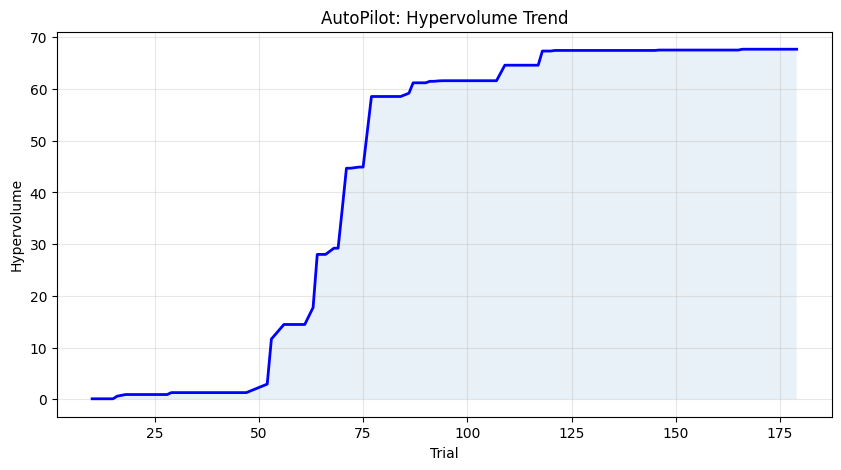
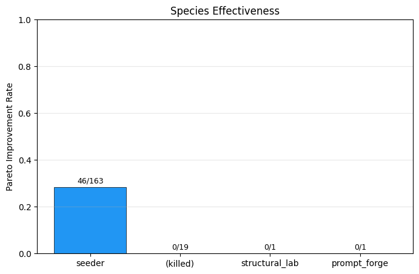
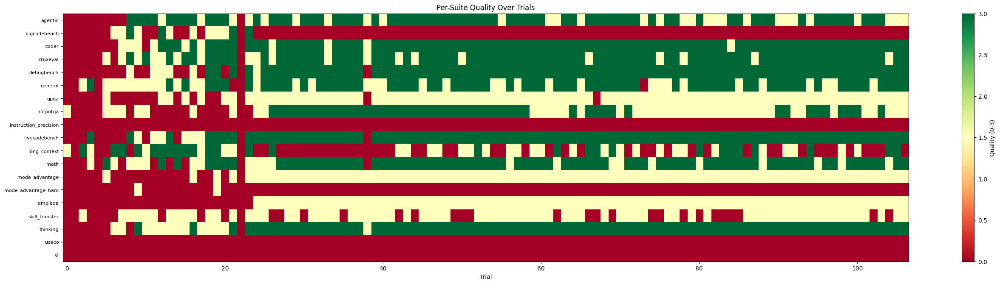
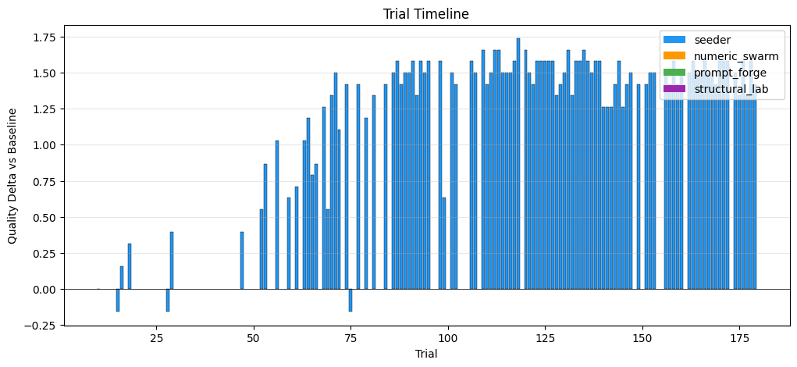
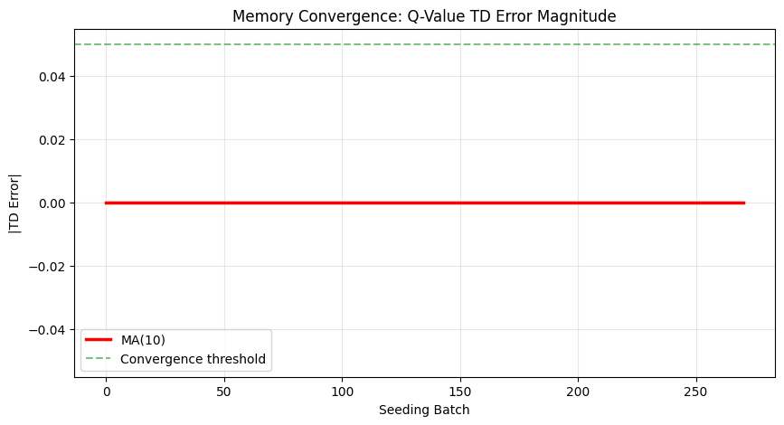

# epyc-orchestrator

Hierarchical multi-model orchestration for **CPU-only local LLM inference** on AMD EPYC. Routes tasks across 20 llama-server ports + 3 infrastructure services with automatic escalation, speculative decoding, KV-cache compression, a learned routing classifier, episodic memory, and a continuously-running autonomous-optimization loop (AutoPilot).

Running on a single AMD EPYC 9655 (96C/192T, 1.13 TB DDR5-5600). No GPU.

---

## 📚 Knowledge Base — Start Here

This repo is the production substrate; the *why* lives in [epyc-root](https://github.com/pestopoppa/epyc-root):

| Index | What's there |
|---|---|
| **[wiki/INDEX.md (epyc-root)](https://github.com/pestopoppa/epyc-root/blob/main/wiki/INDEX.md)** | 30 compiled topic articles — speculative decoding, KV cache, routing, hardware optimization, autonomous research, … |
| **[handoffs/active/master-handoff-index.md (epyc-root)](https://github.com/pestopoppa/epyc-root/blob/main/handoffs/active/master-handoff-index.md)** | Active cross-repo work queue (95 active items) |
| **[research/deep-dives/ (epyc-root)](https://github.com/pestopoppa/epyc-root/tree/main/research/deep-dives)** | 105 long-form analyses |
| **[research/intake_index.yaml (epyc-root)](https://github.com/pestopoppa/epyc-root/blob/main/research/intake_index.yaml)** | 595 triaged papers/repos with verdicts |
| **In-repo docs** | [`docs/ARCHITECTURE.md`](docs/ARCHITECTURE.md), [`docs/chapters/INDEX.md`](docs/chapters/INDEX.md) (17 chapters: runtime, REPL, MemRL, escalation, tools, SkillBank), [`scripts/autopilot/program.md`](scripts/autopilot/program.md) |

---

## What It Does

- **Multi-tier routing** with **learned classifier** (98.7% val acc, in shadow mode pending 24-48 h window): routes tasks to the right model — fast workers for simple queries, architects for complex reasoning.
- **Automatic escalation**: failed or timed-out tasks escalate to a more capable tier.
- **Speculative decoding** — draft models accelerate generation (2–4× depending on target).
- **KV-cache compression** — AM (Attention Matching) `POST /slots/{id}?action=compact` endpoint for 5× compression at zero quality cost; EA (Expected Attention) scoring for importance-weighted eviction.
- **Web search** via SearXNG metasearch (local Docker) with DuckDuckGo + Brave + Qwant fallback.
- **ColBERT retrieval** — multi-vector code + document retrieval via NextPLAID; internal markdown KB indexed (409 files / 13.5 K chunks / 861 MiB / 17-min build).
- **Episodic memory (MemRL)** — FAISS-backed session memory with skill tracking; routing weights converged.
- **Sandboxed REPL** — code execution, web fetch, plugin tools.
- **Vision pipeline** — Qwen2.5-VL-7B worker + Qwen3-VL-30B-A3B escalation, OCR, image understanding.
- **AutoPilot** — autonomous optimization loop with 4 species (Seeder, NumericSwarm, PromptForge, StructuralLab), 4D Pareto archive (quality × speed × −cost × reliability), tiered eval tower (T0/T1/T2), safety gate, experiment journal, GEPA evolutionary prompt mutation, Evolution Manager strategy distillation, episodic-memory routing, constrained-creativity stagnation-gated planner, and (since 2026-05-24) full resilience against operator-initiated orchestrator/llama reloads.

---

## Production Stack (2026-05-24)

All servers run on a single AMD EPYC 9655 via the `production-consolidated-v5` llama.cpp branch (Hadamard auto-rotation, flash attention, KV q4_0 K / f16 V, NPS4 NUMA + CCD work distribution, AVX-512BW 8×8 Q8_0 kernel, OMP idle-spin fix).

### LLM Servers (20 llama-server ports — query live via `/dashboard/api/llama_fleet_ids`)

| Role | Model | Quant | Port(s) | Notes |
|---|---|---|---|---|
| frontdoor / coder_escalation / worker_summarize | Qwen3.6-35B-A3B | Q8_0 (37 GB) | 8070, 8080, 8180, 8280, 8380 | Shared GGUF mmap. `enable_thinking=False` mandatory. +33pp accuracy + 80% t/s vs prior Qwen3.5-35B Q4_K_M baseline. |
| worker_general | gemma-4-26B-A4B | Q4_K_M (16 GB) | 8082, 8182, 8282, 8382 | ik_llama.cpp PR #1744 MTP. +18pp tool_compliance, 76.5 t/s solo. Needs `KMP_BLOCKTIME=10` (OMP idle-spin fix). |
| worker_general / worker_math / toolrunner | Qwen3-Coder-30B-A3B-Instruct | Q4_K_M (17 GB) | 8072 | Secondary worker pool. |
| architect_general | Qwen3.5-122B-A10B | Q4_K_M (69 GB) | 8083 | Hybrid MoE. `enable_thinking=False`. |
| ingest_long_context | Qwen3-Next-80B-A3B-Instruct | Q4_K_M (45 GB) | 8085 | SSM+MoE hybrid. Thinking ON (exception to the Qwen3.x default). |
| worker_vision | Qwen2.5-VL-7B-Instruct | Q4_K_M (4 GB) | 8086 | |
| vision_escalation | Qwen3-VL-30B-A3B-Instruct | Q4_K_M (18 GB) | 8087 | |
| embedder pool ×6 | BGE-large-en-v1.5 | f16 (0.6 GB) | 8090–8095 | 1024-dim embeddings. |

**Note:** `architect_coding` (formerly REAP-246B) was retired 2026-05-09 — Qwen3.6-35B-Q8 on coder_escalation beats it by ≈27 pp at <1/7 the memory. See [project_stack_consolidation_2026_05](../epyc-root/wiki/inference-serving.md) for the deconsolidation rationale.

### Infrastructure Services (Docker)

| Service | Port | Purpose |
|---|---|---|
| nextplaid-code | 8088 | ColBERT multi-vector code retrieval (LateOn-Code) |
| nextplaid-docs | 8089 | ColBERT multi-vector doc retrieval (GTE-ModernColBERT) |
| searxng | local | Metasearch (JSON API; DuckDuckGo + Brave + Qwant + Wikipedia consensus) |

---

## AutoPilot: Continuous Optimization

The orchestrator includes an autonomous optimization loop (AutoPilot) that continuously improves prompts, routing, and model configurations through controlled experiments with safety gates.

**513 trials completed** (96.3% trustworthy — 13 historically corrupted by a known chat-template bug, scrubbed). 4 optimizer species, tiered eval tower (T0 = 10 q / 30 s; T1 = 100 q / 5 min; T2 = 500+ q / 30 min), 4D Pareto archive, safety gate with MAD-based statistical noise filtering, atomic experiment journal with planner-trustworthiness gating, full crash-resilience (operator reloads no longer pollute; autopilot SIGKILL is recoverable via WAL-style in-flight marker).

### Diagnostic Plots

The plots committed below are a **2026-04-15 snapshot at trial 192** — captured before the May 2026 stack consolidation and the constrained-creativity / exogenous-restart upgrades. Refreshing them past the latest model swaps is queued under [readme-refresh.md](https://github.com/pestopoppa/epyc-root/blob/main/handoffs/active/readme-refresh.md).

#### Objectives Overview

Quality (Claude-as-Judge 0–3), speed (e2e t/s), cost (normalized 0–1), reliability (success fraction).

#### Pareto Frontier

Quality × speed. End-to-end pipeline speeds (47–65 t/s) exceed any single model because of multi-instance NUMA fan-out, draft acceleration, and REPL amortization.

#### Hypervolume Trend

Hypervolume indicator over trial count — measures Pareto-dominated volume in objective space.

#### Species Effectiveness

Pareto-improvement rate per optimization species.

#### Per-Suite Quality

Quality breakdown by benchmark suite for the current best configuration.

#### Trial Timeline

Chronological view colored by species.

#### Memory Convergence

Q-value TD-error magnitude for MemRL routing — converged (MA-10 ≈ 0, below threshold).

---

## Quick Start

```bash
# 1. Clone
git clone https://github.com/pestopoppa/epyc-orchestrator.git
cd epyc-orchestrator
pip install -e ".[dev]"

# 2. Launch full stack (orchestrator + all llama-servers)
python scripts/server/orchestrator_stack.py start

# 3. Verify live state
curl http://localhost:8000/dashboard/api/version       # orchestrator git_sha + start time
curl http://localhost:8000/dashboard/api/llama_fleet_ids   # per-port marker map
curl http://localhost:8000/health                       # backend probes + knowledge-tool status

# 4. Pre-flight diagnostic + AutoPilot
python scripts/autopilot/preflight_audit.py
python scripts/autopilot/autopilot.py start --tui
```

Dashboard at `http://localhost:8000/dashboard/`.

---

## Architecture

```
Request → FastAPI (:8000) → ChatPipeline → Mode selection
                                            ├── Direct  → LLM call → Response
                                            ├── REPL    → Tool loop → Response
                                            └── Delegated → Architect plan → Worker execution

Model stack (20 llama-server ports, NPS4 across 4 NUMA quarters):
  Tier A: Front door (5× Qwen3.6-35B-A3B Q8 shared mmap)
  Tier B: Architects (Qwen3.5-122B-A10B Q4 dense-MoE, Qwen3-Next-80B-A3B SSM-hybrid)
  Tier C: Workers (4× gemma-4-26B-A4B MTP, 1× Qwen3-Coder-30B-A3B, VL 7B + 30B)
  Tier D: Embedders (6× BGE-large)

Routing: LearnedRoutingClassifier (98.7%, shadow mode) → falls through to MemRL
         → falls through to rule-based difficulty heuristics

AutoPilot: Controller → 4 species (Seeder / NumericSwarm / PromptForge / StructuralLab)
           → EvalTower (T0 sentinel → T1 deep → T2 full)
           → SafetyGate (MAD-noise-filtered) → ParetoArchive → Journal
           → Evolution Manager (strategy distillation every 5 trials)
           → OrchestratorWatcher + resilient_post (exogenous-reload resilience)
```

---

## Eval Suites

Benchmarks live in the [epyc-inference-research](https://github.com/pestopoppa/epyc-inference-research) repo (30+ suites, 57 K questions). The autopilot eval tower references them via shared model registry. See:

- [Master results table](https://github.com/pestopoppa/epyc-inference-research/blob/main/docs/reference/benchmarks/RESULTS.md)
- [Benchmark methodology wiki](https://github.com/pestopoppa/epyc-root/blob/main/wiki/benchmark-methodology.md)

---

## Documentation

| Doc | What's there |
|---|---|
| [`docs/ARCHITECTURE.md`](docs/ARCHITECTURE.md) | Module responsibilities, request flow |
| [`docs/chapters/INDEX.md`](docs/chapters/INDEX.md) | 17 deep chapters: runtime, REPL, MemRL, escalation, tools, SkillBank |
| [`scripts/autopilot/program.md`](scripts/autopilot/program.md) | Operator-editable strategy doc the controller reads |
| [`scripts/server/orchestrator_stack.py`](scripts/server/orchestrator_stack.py) | Single source of truth for the stack launch (HOT/WARM, NUMA pinning, OMP env) |
| [`orchestration/model_registry.yaml`](orchestration/model_registry.yaml) | Active stack + drafter catalogue (~80 entries) |

---

## Development

```bash
pytest tests/ -n 8                             # parallel test run
ruff check src/                                # lint
python scripts/autopilot/preflight_audit.py    # 9-check diagnostic
```

Pre-edit gate for non-trivial changes: run `gitnexus impact <symbol> --direction upstream` (see [CLAUDE.md](CLAUDE.md)). The wrapper script `scripts/gitnexus-analyze.sh` re-indexes without re-bloating agent files.

---

## License

MIT — see [LICENSE](LICENSE). Model licenses vary; see registry entries.
