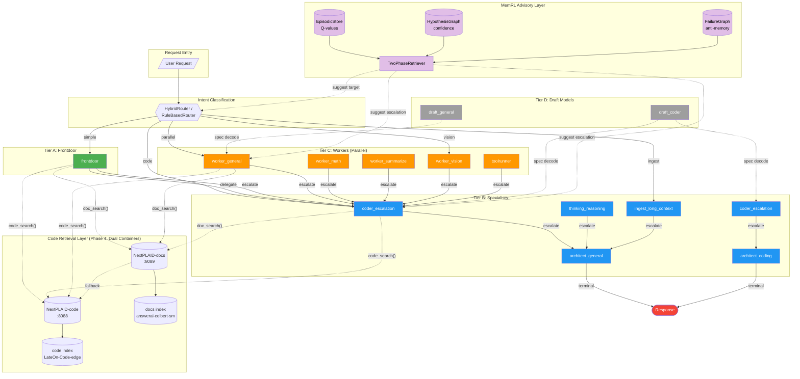
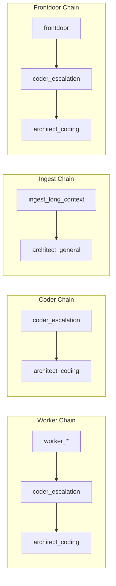
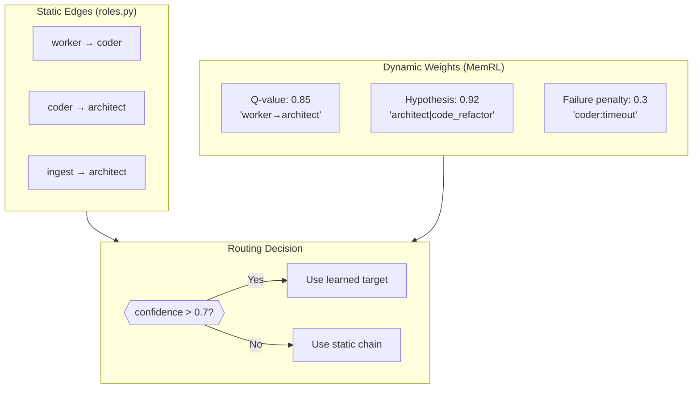
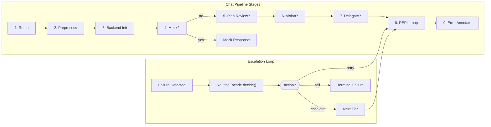

# Orchestration Routing Topology

> Auto-generated from `src/roles.py` and `src/escalation.py`
> Last updated: 2026-02-07

## Complete Routing Graph

## Escalation Chains (Static)

## MemRL-Informed Dynamic Routing

## Pipeline Stages

## Source Files

| Component | File | Line |
|-----------|------|------|
| Role definitions | `src/roles.py` | 55-176 |
| Escalation map | `src/roles.py` | 274-292 |
| Tier map | `src/roles.py` | 251-271 |
| Escalation policy | `src/escalation.py` | 1-300 |
| Routing facade | `src/routing_facade.py` | 1-135 |
| Failure router | `src/failure_router.py` | 1-600 |
| Pipeline stages | `src/api/routes/chat_pipeline/` | — |
| MemRL retriever | `orchestration/repl_memory/retriever.py` | 1-300 |
| Hypothesis graph | `orchestration/repl_memory/hypothesis_graph.py` | 1-200 |
| Failure graph | `orchestration/repl_memory/failure_graph.py` | 1-200 |
